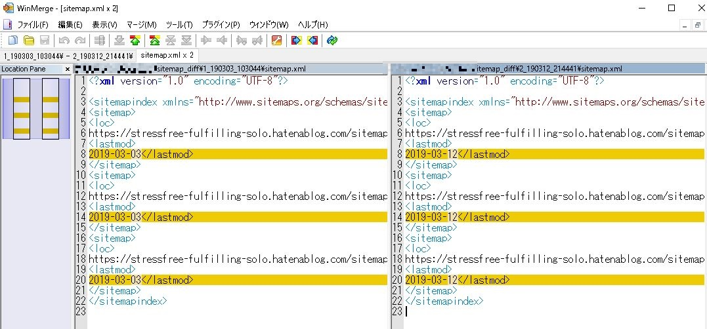

# hatenablog-sitemap-diff
はてなブログのサイトマップがどのように更新されるかを知りたかったので、実際に採取してみた。

## 採取先
- https://stressfree-fulfilling-solo.hatenablog.com/sitemap.xml
- https://stressfree-fulfilling-solo.hatenablog.com/sitemap_page.xml
- https://stressfree-fulfilling-solo.hatenablog.com/sitemap.xml?page=1
- https://stressfree-fulfilling-solo.hatenablog.com/sitemap.xml?page=2

## 採取日時
- 1回目の採取: 19/03/03 10:30:44 頃
- 2回目の採取: 19/03/12 21:44:41 頃

## どのように更新されるかを調べる方法
WinMerge などでフォルダ比較する。

ただし XML ファイル素のままだと比較しづらいので、`>` → `>\n` に置換してから比較している。
